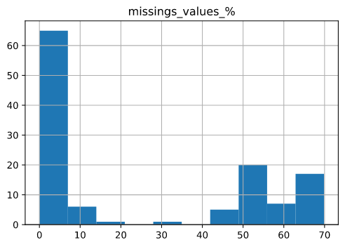
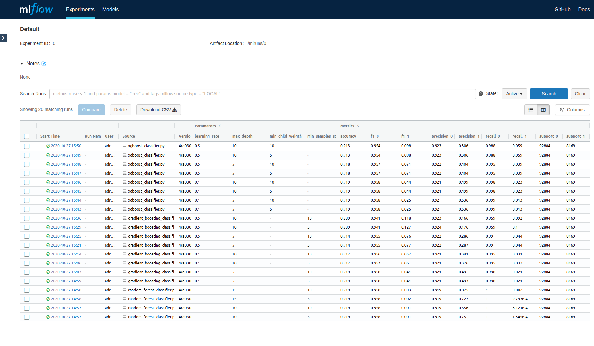
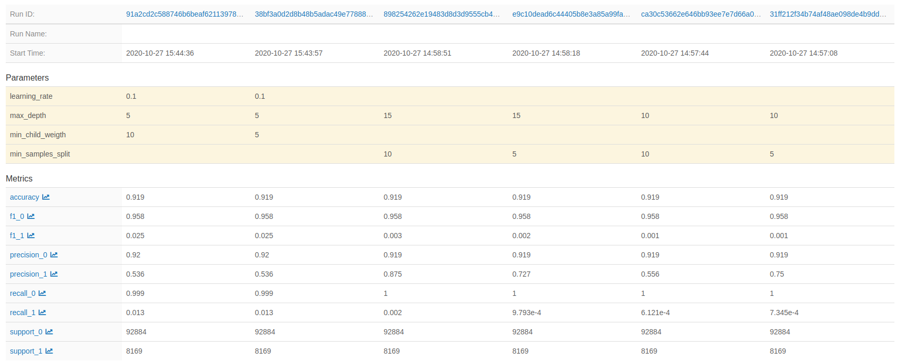
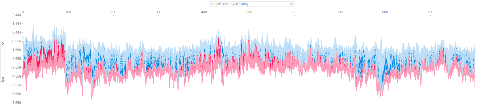
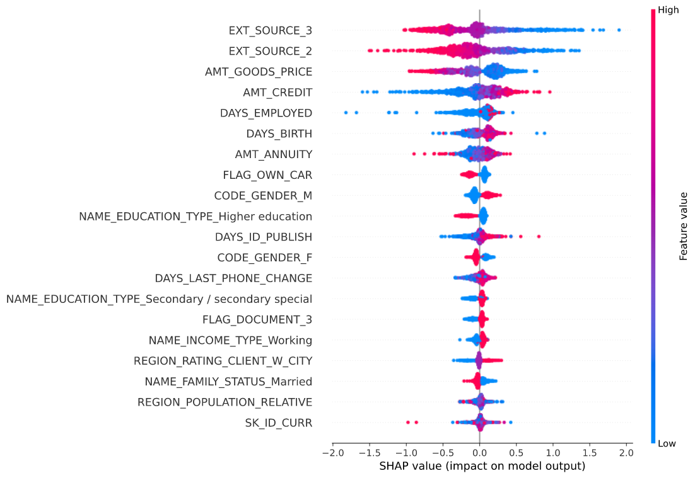

Adrien MICHEL \
28/10/2020

<br>

# <center> Repport of project </center>

### Part1 (Building ML Models with coding best pratices)

#### Data exploration

Our dataset [dataset](https://www.kaggle.com/c/home-credit-default-risk/data) contains 307511 rows and 121 features. \

The target output is composed of 2 classes with 282686 entries for class 0, and 24825 entries for class 1
```py
>>> df.groupby('TARGET')['TARGET'].count()
>>> TARGET
0    282686
1     24825
Name: TARGET, dtype: int64
```
There is a lot of features containing a lot of null values



#### Feature engineering

So, we delete features with more than 20% of null values, because they will not be significant for our models.

Next, we delete rows with at least one null value in the categorical features because we lost few data (1292)

We encode categorical features with a label encoder for features with only 2 values and a one hot encoding for the others

We keep numerical features intact

#### Model building

For this project, we choosed 3 models. \
Our problem being a classifying problem, we chose 4 metrics to evaluate our models' performance : 
* accuracy
* precision
* recall
* f1 score

##### &nbsp;&nbsp;*Random forest classifier*
We chose only two parameters :
* max_depth
* min_samples_split
##### &nbsp;&nbsp;*Gradient boosting classifier*
We chose only three parameters : 
* learning_rate"
* max_depth
* min_samples_split.
##### &nbsp;&nbsp;*XGBoost classifier*
We chose only three parameters : 
* learning_rate"
* max_depth
* min_child_weigth

### Part 2 (Using MLFLow)

We started a tracking server on local at http://127.0.0.1:5000 to monitor our models' trainings

```sh
(appOfBd_project_env) adrien@adrien-Swift-SF515-51T:~/Documents/Ecole/EFREI/M2-EFREI/Applications of Big Data/appBdProject$ mlflow server
[2020-10-27 10:38:38 +0100] [12022] [INFO] Starting gunicorn 20.0.4
[2020-10-27 10:38:38 +0100] [12022] [INFO] Listening at: http://127.0.0.1:5000 (12022)
[2020-10-27 10:38:38 +0100] [12022] [INFO] Using worker: sync
[2020-10-27 10:38:38 +0100] [12024] [INFO] Booting worker with pid: 12024
[2020-10-27 10:38:38 +0100] [12032] [INFO] Booting worker with pid: 12032
[2020-10-27 10:38:38 +0100] [12033] [INFO] Booting worker with pid: 12033
[2020-10-27 10:38:38 +0100] [12034] [INFO] Booting worker with pid: 12034
```
<br>

After running multiple models with different parameters, we have obtained this tracking window



To choose the best model, we filter in MLflow the models which obtained the best scores for accuracy and precision with this following command :\
 ```
 metrics.precision_1 > 0.7 and metrics.precision_0 > 0.9 and metrics.accuracy > 0.9
 ```


The best model is the random forest classifier with *max_depth=10* and *min_samples_split=10* 

### Part 3 (XAI with SHAP Method)


##### *Explanations for a specific point of data set*

##### *explanations for all points of data set at once*

##### *Summary plot*
